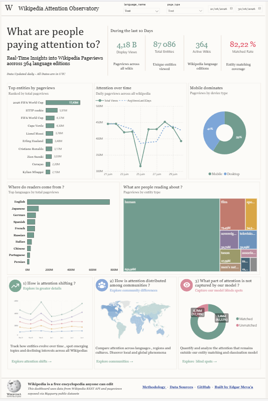
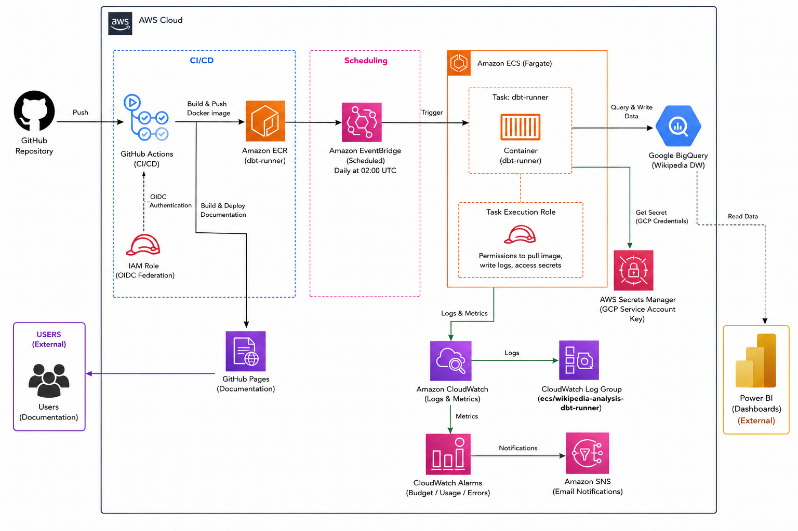
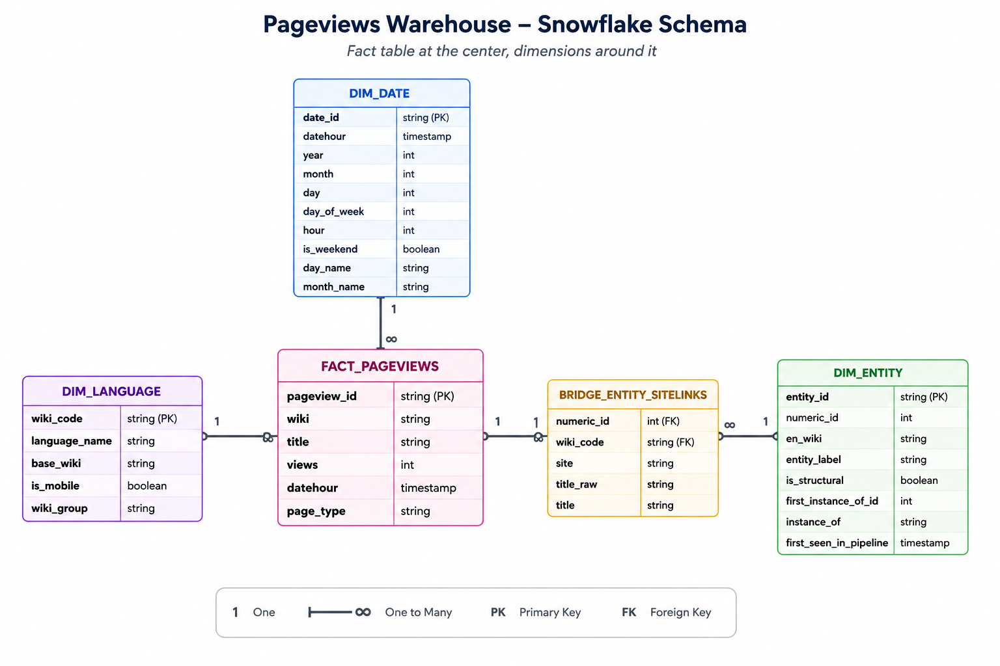
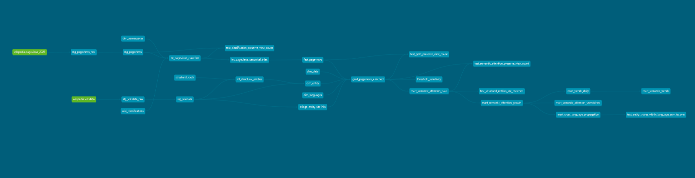
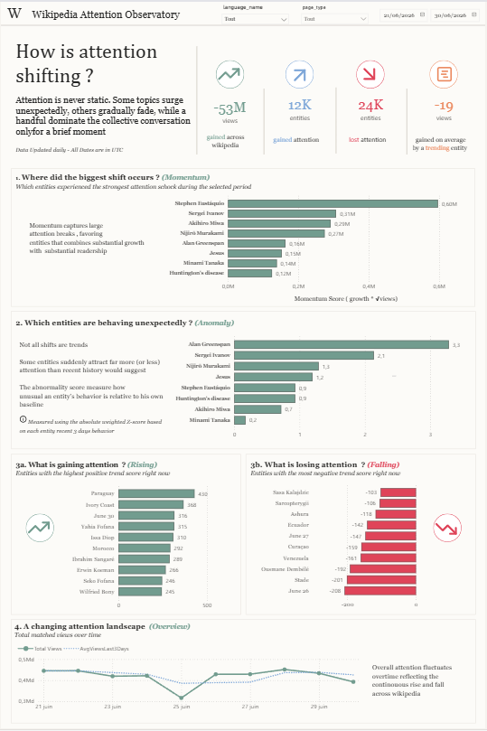
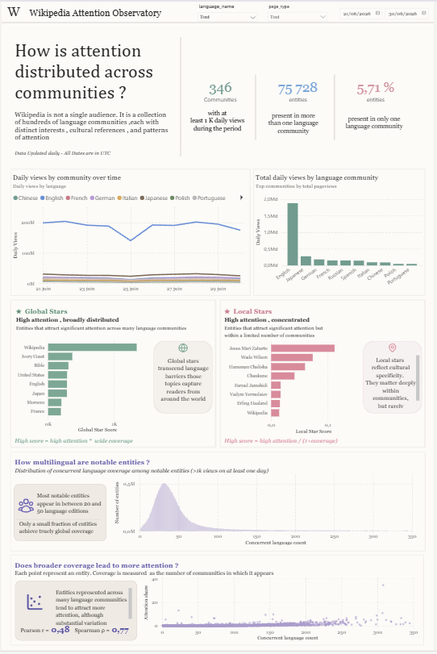
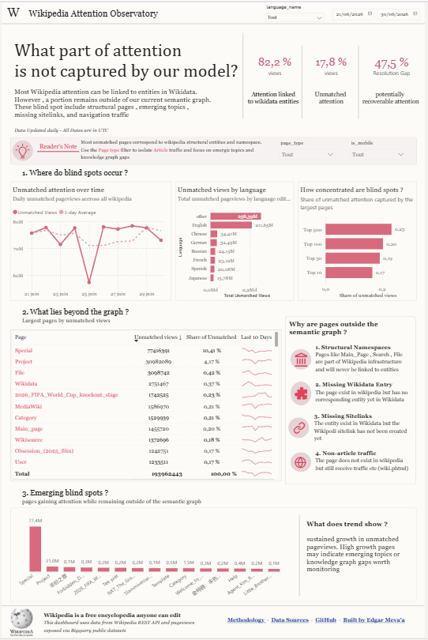
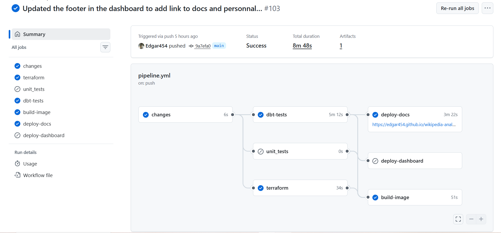
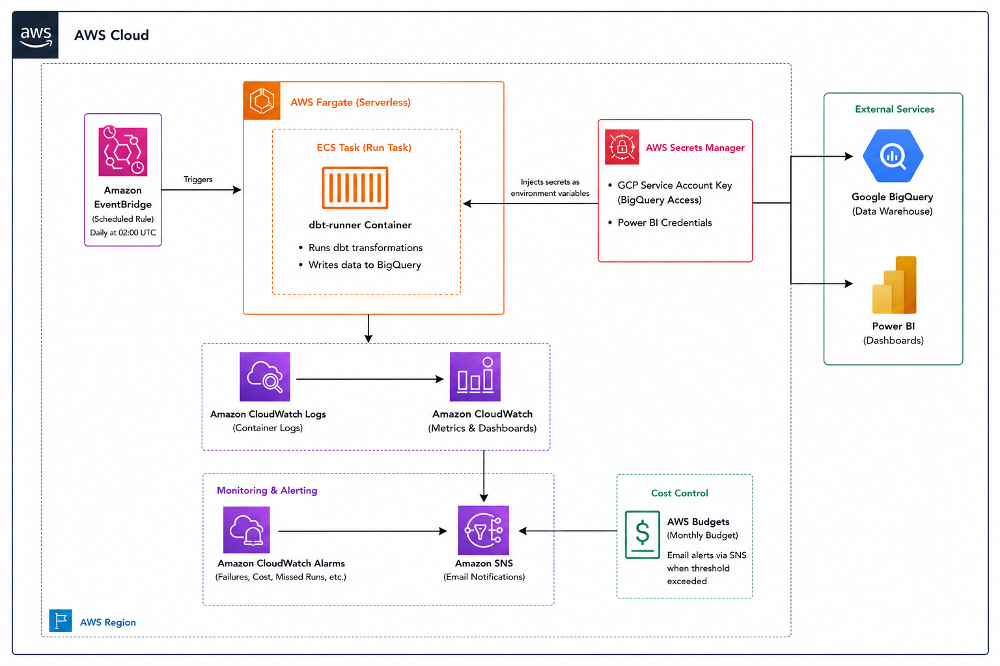
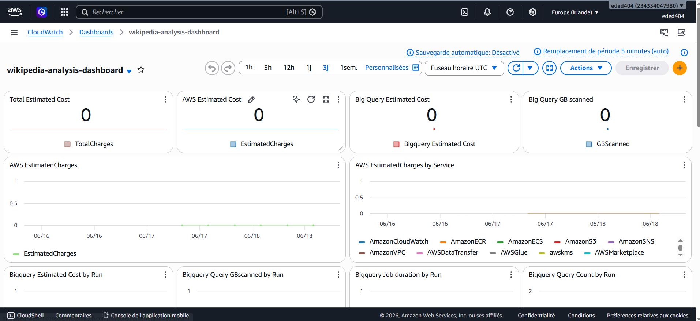

# Wikipedia Attention Observatory


A semantic analytics platform that transforms raw Wikimedia pageviews into an entity-centric attention dataset for studying how collective attention evolves across languages, communities, and time.

Built with **dbt**, **BigQuery**, **Power BI**, **AWS Fargate**, **Terraform**, and **GitHub Actions**.

> Wikipedia publishes pageviews for transparency.
>
> This project turns them into an analytical dataset.

---

## Dashboard Preview



---

## Live

| Resource              | Link                   |
| --------------------- | ---------------------- |
| 📊 Power BI Dashboard | [Dashboard Link](https://app.fabric.microsoft.com/view?r=eyJrIjoiYzVhYmFlYTctOWE4Zi00ZjgxLWIzYjgtNjI4NWRjODIzNGRiIiwidCI6ImNjNTA2ODBjLTBmZTctNGQ5YS04ZWVkLTRjNWE1NjZkYzYxNSJ9)     |
| 📖 dbt Documentation  | https://edgar454.github.io/wikipedia-analytics-warehouse/ |

---

# Why This Project?

Wikipedia records billions of pageviews every day.

The problem is that pageviews are published at the **page level**, not the **concept level**.

| Page        | Wiki              |
| ----------- | ----------------- |
| Germany     | English Wikipedia |
| Allemagne   | French Wikipedia  |
| Deutschland | German Wikipedia  |
| ألمانيا     | Arabic Wikipedia  |

Different pages.

Same concept.

Wikimedia publishes pageviews for transparency rather than analysis. Each observation contains only:

* Timestamp
* Wiki edition
* Page title
* View count

There is no semantic identity, no cross-language mapping, and no way to aggregate attention around the same concept.

This project introduces that semantic layer by resolving pages into Wikidata entities and building an analytical model capable of answering a simple question:

> What are people paying attention to?

---

# What It Measures

This project measures **attention**, not importance.

A topic can dominate attention for a few days without being historically significant.

For example:

> Claude Lemieux is not more important than Donald Trump.
>
> But on the day he died, more people searched for him.

The objective is therefore not to measure relevance, quality, or impact.

The objective is to measure where collective attention is directed.

---

# Architecture Overview



The platform combines:

* BigQuery for analytical processing
* dbt for semantic modeling
* AWS Fargate for orchestration
* Terraform for infrastructure provisioning
* GitHub Actions for CI/CD
* CloudWatch for observability
* Power BI for visualization

---

# Data Model

The final analytical grain is:

```text
Entity × Day × Language × Medium
```

where:

* **Entity** represents the semantic concept
* **Day** represents the observation period
* **Language** represents the Wikipedia community
* **Medium** distinguishes desktop and mobile traffic

Additional attributes such as entity type, parent entity, structural classification, and reconciliation status are modeled as properties of the entity dimension.

## Semantic Model



## dbt Lineage



---

# Dashboards

The project is organized around four analytical questions.

---

## 1. What Are People Paying Attention To?

The foundational dashboard.

Before studying how attention shifts or spreads, it is useful to observe attention directly.

Features:

* Most viewed entities
* Most viewed entity types
* Attention by language community
* Mobile versus desktop usage
* Attention evolution over time


---

## 2. How Is Attention Shifting?

Popularity tells us what is large.

This dashboard tells us what is changing.

The objective is to identify:

* Emerging entities
* Declining entities
* Sustained growth
* Bursts of attention
* Unexpected anomalies

The trend score combines:

* Log-transformed views
* Moving-average smoothing
* Local slope estimation
* Attention weighting

to reward sustained movement while reducing sensitivity to short-lived spikes.



---

## 3. How Is Attention Distributed Across Communities?

Wikipedia is not a single audience.

It is a collection of hundreds of language communities with distinct interests, cultures, and patterns of attention.

This dashboard explores:

* Community attention distribution
* Global stars
* Local stars
* Coverage versus attention analysis
* Cross-language attention patterns



---

## 4. What Part of Attention Is Not Captured?

Not every pageview can be resolved to a Wikidata entity.

Unmatched traffic can represent:

* Wikimedia infrastructure pages
* Missing Wikidata sitelinks
* Emerging concepts not yet represented in the graph

Rather than treating unmatched traffic as noise, this dashboard explores its structure and highlights potential modeling opportunities.



---

# Infrastructure

The platform was designed around four principles:

* Low operational cost
* Reliability
* Reproducibility
* Observability

Most computation occurs inside BigQuery.

As a result, orchestration remains intentionally lightweight and inexpensive.

---

## Reproducibility

The platform can be recreated on a new cloud account with minimal manual intervention.

A small Terraform bootstrap project located in `bootstrap_infra/` provisions the only resources that cannot provision themselves:

* Remote Terraform state storage
* GitHub OpenID Connect (OIDC) trust relationship
* Deployment IAM role

After authenticating to AWS locally, running the bootstrap Terraform project produces the deployment role used by GitHub Actions.

From that point onward, infrastructure, analytical models, documentation and dashboards are deployed automatically through CI/CD.

The only mandatory GitHub secret is:

* `GCP_SERVICE_ACCOUNT_KEY`

The GCP service account requires:

* BigQuery Data Editor
* BigQuery User
* BigQuery Job User
* Resource Viewer

If AWS infrastructure is deployed from GitHub Actions, the following secret is also required:

* `AWS_GITHUB_ROLE_ARN`

Power BI deployment is completely optional.

When the `POWER_BI_CREDENTIALS` secret is not configured, the analytical pipeline continues to execute normally and simply skips dashboard deployment.

When provided, the secret must contain:

```json
{
  "TENANT_ID": "...",
  "CLIENT_ID": "...",
  "CLIENT_SECRET": "...",
  "FABRIC_EMAIL": "user@example.com",
  "WORKSPACE_NAME": "New Wikipedia Analysis Workspace",
  "DATASET_NAME": "wikipedia dashboard"
}
```

No long-lived AWS credentials are stored inside GitHub.

Authentication between GitHub Actions and AWS is performed dynamically through OpenID Connect (OIDC).

---

## CI/CD Pipeline



The deployment workflow is organized around path-based change detection so that only the affected components are executed.

Examples:

* Infrastructure changes trigger Terraform validation and deployment.
* dbt changes trigger model validation and testing.
* Telemetry changes trigger Python unit tests.
* Documentation changes avoid unnecessary infrastructure work.
* Dashboard changes trigger Power BI deployment.

The pipeline includes:

* Infrastructure validation and deployment
* dbt validation and testing
* Python unit testing
* Container publishing
* Documentation publishing
* Optional Power BI dashboard deployment

The Power BI deployment workflow executes only when the dashboard or deployment code changes.

It automatically:

1. Uploads the PBIX file
2. Waits for import completion
3. Configures the BigQuery datasource credentials
4. Updates Power Query parameters
5. Triggers the initial dataset refresh

If the `POWER_BI_CREDENTIALS` secret is not present, this entire deployment stage is skipped while the remainder of the pipeline continues to execute normally.
---

## AWS Infrastructure



Infrastructure is provisioned through Terraform and deployed through GitHub Actions using OpenID Connect (OIDC).

The execution layer runs on AWS Fargate.

Because BigQuery performs nearly all analytical processing, the execution container requires very little compute capacity.

Typical execution cost is approximately:

```text
~$0.05 per scheduled run
```

In practice, AWS Secrets Manager costs more than running the scheduled task itself.

---

## Observability



Operational metadata is extracted directly from BigQuery INFORMATION_SCHEMA views after every execution.

The telemetry layer collects:

* Query duration
* Data scanned
* Execution status
* Model-level execution metrics
* Pipeline-level metrics

dbt metadata embedded within BigQuery query comments is used to attribute costs and execution statistics to individual dbt assets.

Metrics are published to CloudWatch and visualized through custom dashboards.

This makes it possible to answer questions such as:

* Which models scan the most data?
* Which models are becoming more expensive?
* How long does each transformation take?
* How successful are scheduled runs over time?

without directly accessing BigQuery.

---

# Repository Structure

```text
.
├── bootstrap_infra/     # Terraform bootstrap resources (state backend + OIDC role)
├── infra/               # Main infrastructure definitions
├── dbt/                 # Models, tests, macros, seeds and documentation
├── telemetry/           # BigQuery → CloudWatch observability pipeline
├── tests/               # Python unit tests
├── assets/              # Diagrams, screenshots and visual assets
├── .github/             # GitHub Actions workflows and reusable actions
├── scripts/             # Utility scripts and operational tooling
├── docs/                # Project documentation
├── Dockerfile           # Execution container definition
└── conftest.py          # Pytest configuration
```

---

# Documentation

| Document                              | Description                                       |
| ------------------------------------- | ------------------------------------------------- |
| [engineering.md](docs/engineering.md) | Data modeling, reconciliation and semantic design |
| [dashboard.md](docs/dashboard.md)     | Dashboard design and metric definitions           |
| [infra.md](docs/infra.md)             | Infrastructure and deployment architecture        |
| [dbt Docs](https://edgar454.github.io/wikipedia-analytics-warehouse/)    | Generated lineage graph and model documentation   |

---

# Key Capabilities

* Semantic reconciliation of Wikipedia pageviews through Wikidata sitelinks
* Cross-language attention analysis across 300+ Wikipedia communities
* Entity-centric analytical model supporting desktop and mobile traffic
* Attention trend, burst, anomaly, and coverage analysis
* Automated dbt pipeline running on AWS Fargate and BigQuery
* Infrastructure-as-Code deployment through Terraform
* End-to-end observability with cost attribution at the dbt model level
* Interactive Power BI dashboards for attention exploration

---

# Technologies

### Analytics


### Cloud & Infrastructure


### CI/CD & Observability


### Development


---

# Future Work

* Incremental processing strategy
* Additional attention dynamics research

---

# License

MIT License
