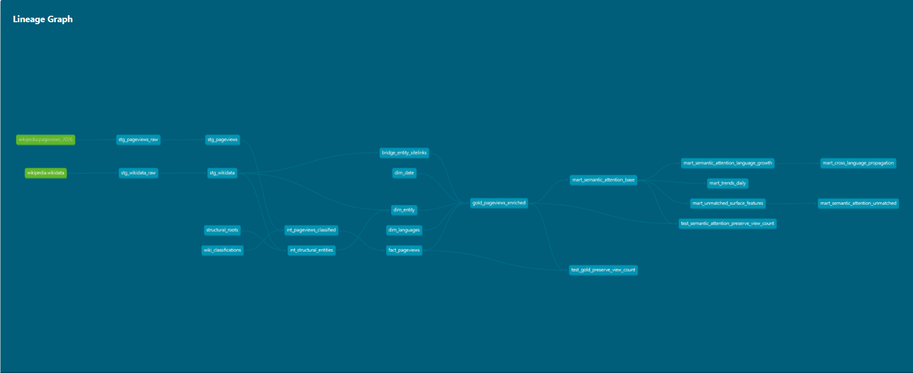

# Wikipedia Analytics Warehouse  
## Turning 21.9B messy pageviews into a semantic global attention system

Wikipedia generates one of the largest open behavioral datasets on the internet: 21.9 billion hourly pageviews across 300+ languages.

But there’s a fundamental problem:

Pageviews are not connected to stable entities, and most of the traffic cannot be reliably interpreted at scale.

This makes it extremely hard to answer questions like:

- What is the world paying attention to right now?
- How does information propagate across languages?
- Which topics are rising globally vs locally?
- What knowledge is missing from structured datasets like Wikidata?

---

# What this project does

This project builds a semantic analytics warehouse on top of raw Wikipedia traffic, transforming noisy pageviews into structured analytical signals.

It:

- Reconstructs entity meaning using Wikidata sitelinks
- Resolves multilingual ambiguity across 300+ language wikis
- Separates semantic signal from navigation noise
- Builds analytical marts for trends, propagation, and demand gaps
- Preserves uncertainty instead of discarding it

Result: a global attention graph derived from raw human information behavior.

---

# Why this is hard

Most analytics systems assume:

clean keys, stable dimensions, structured entities

Wikipedia provides none of that.

Instead:

- 21.9B raw behavioral events
- No canonical entity key in pageviews
- Strong multilingual fragmentation
- Partial coverage in Wikidata (~85% ceiling)
- Ambiguity between what was viewed and what it refers to

So the real problem is not scale.

It is:

reconstructing meaning from unstructured global attention flow

---

# Key insight

Instead of forcing clean joins, this warehouse:

- treats unmatched traffic as signal, not noise
- explicitly models uncertainty (matched / unmatched / structural / namespace)
- separates semantic resolution from aggregation
- preserves raw grain for reinterpretation

Missing data becomes a first-class analytical signal.

---

# Architecture Overview

## End-to-end lineage

Pipeline flow:

- staging → cleaning & normalization
- intermediate → semantic reconstruction
- gold → 
- marts → analytical outputs

---

## Semantic data model

Core structure:

- Pageviews → attention signals
- Wikidata → semantic anchors
- Sitelinks → multilingual resolution layer

Unlike a classic star schema:

this model prioritizes semantic correctness over query simplicity

---

# Stack

| Tool | Role |
|------|------|
| BigQuery (Sandbox) | 21.9B-row distributed compute |
| dbt 1.11 | Transformation + semantic modeling |
| Airflow | Orchestration (designed, not deployed) |
| Power BI | Analytical consumption layer |

---

# Core Design Decisions

## Multilingual entity resolution via sitelinks

Direct joins like:

pageviews.title = wikidata.en_title

fail outside English Wikipedia.

So the system builds a sitelink-based multilingual bridge.

### Impact

Japanese: 2.3% → 93.3%
Chinese: 3.8% → 71.5%
Russian: 7.9% → 83.6%

This is the main unlock for global analytics.

---

## Uncertainty is preserved, not deleted

Instead of filtering unmatched data:

- matched
- unmatched
- structural
- namespace
- portal

are explicitly modeled.

Why this matters:

- unmatched traffic often represents emerging topics
- local phenomena missing from Wikidata
- early signals of real-world events

Unknown becomes analytical signal, not failure.

---

## Grain-first modeling

Core grain:

wiki + title + datehour

Everything is built around preserving:

- additive correctness
- no double counting
- consistent aggregation logic

Grain is the true schema of the system.

---

## Snowflake over star schema

A pure star schema would require repeated heavy joins to Wikidata.

Instead:

- semantic bridge tables centralize resolution
- marts consume pre-resolved entities
- BI layer stays lightweight

---

# Transformation Pipeline

SOURCES
- pageviews_2026
- wikidata

STAGING
- raw ingestion
- normalization

INTERMEDIATE
- classification
- entity resolution
- sitelink bridge

DIMENSIONS
- date, entity, language

FACTS
- pageviews fact table

GOLD
- pageviews enriched with data from other dimensions for downstream analysis

MARTS
- trends_daily
- cross_language_propagation
- unmatched_demand_signals
- language_growth

---

# Analytical Capabilities

| Mart | Question |
|------|----------|
| trends_daily | global attention |
| cross_language_propagation | diffusion across languages |
| unmatched_demand_signals | missing knowledge graph coverage |
| language_growth | attention acceleration |

---

# Performance & Cost Engineering

Built under BigQuery Sandbox constraints:

- 1TB/month query limit
- 10GB storage limit
- no incremental writes
- no DML operations

Optimization strategy:

- aggregation-first design
- partition filtering
- reusable semantic layers
- scan minimization

Final results:

Full pipeline: ~93 GB scan
Marts only: ~1–2 GB
Estimated production: <25 GB

---

# Testing Strategy

85 dbt tests ensure correctness:

- measure conservation
- grain consistency
- no duplication
- classification stability

---

# Engineering Lessons

OLTP thinking breaks at OLAP scale.

A fact table is not a dataset — it is a projection of a multidimensional observation space.

Constraints shape architecture.

Tests are executable documentation.

---

# Limitations

Temporal mismatch between Wikidata snapshot and historical pageviews.

Notability gap in Wikidata coverage.

Sandbox constraints (no DML, no incremental loads).

---

# Design Philosophy

- grain defines correctness
- uncertainty is modeled, not removed
- semantic layers are reusable assets
- cost is a first-class constraint
- analytical truth > structural elegance
